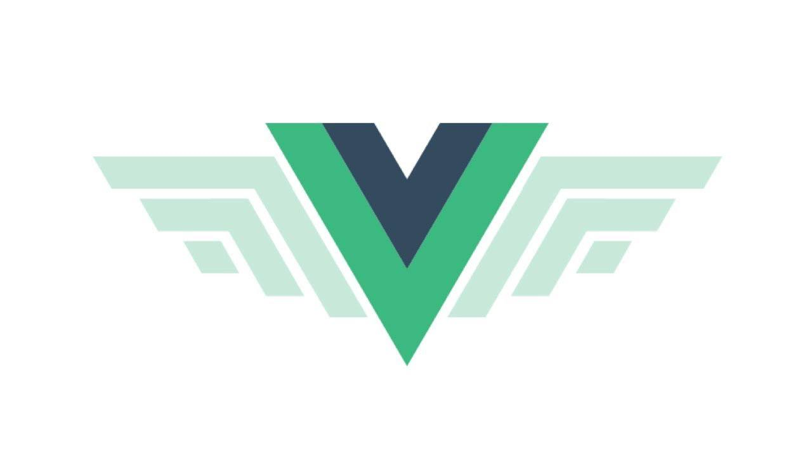

<!--
 * @Author       : HyFun
 * @Date         : 2021-09-14 18:55:11
 * @Description  : 
 * @LastEditors  : HyFun
 * @LastEditTime : 2021-09-15 10:22:52
-->

本书在[Vue2.6.8](./src/Vue-v2.6.8.js)源码基础上，循序渐进的带领你进入神奇的Vue世界。

## 关于Vue

Vue (读音 /vjuː/，类似于 view) 是一套用于构建用户界面的渐进式框架。与其它大型框架不同的是，Vue 被设计为可以自底向上逐层应用。Vue 的核心库只关注视图层，不仅易于上手，还便于与第三方库或既有项目整合。另一方面，当与现代化的工具链以及各种支持类库结合使用时，Vue 也完全能够为复杂的单页应用提供驱动。

## 关于本书

- [Github地址](https://github.com/Ocean1509/In-depth-analysis-of-Vue)
- 关于作者：[Ocean1509](https://github.com/Ocean1509)
- 本网站使用 [Pagic](https://pagic.org/zh-CN/) 构建